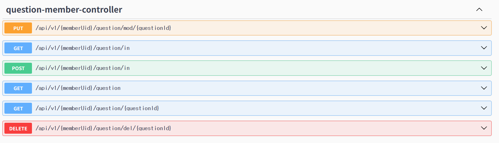
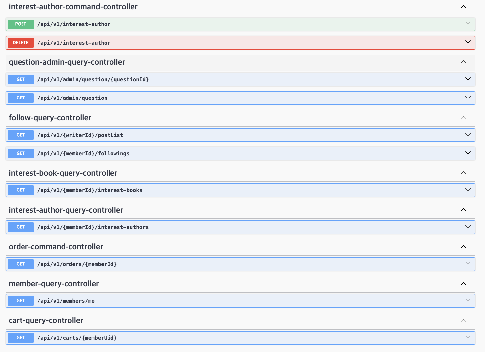
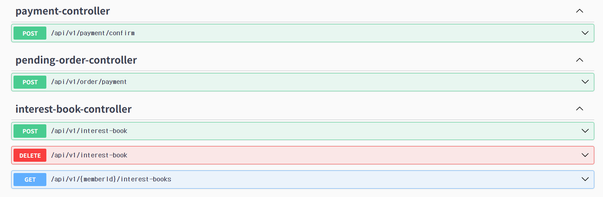
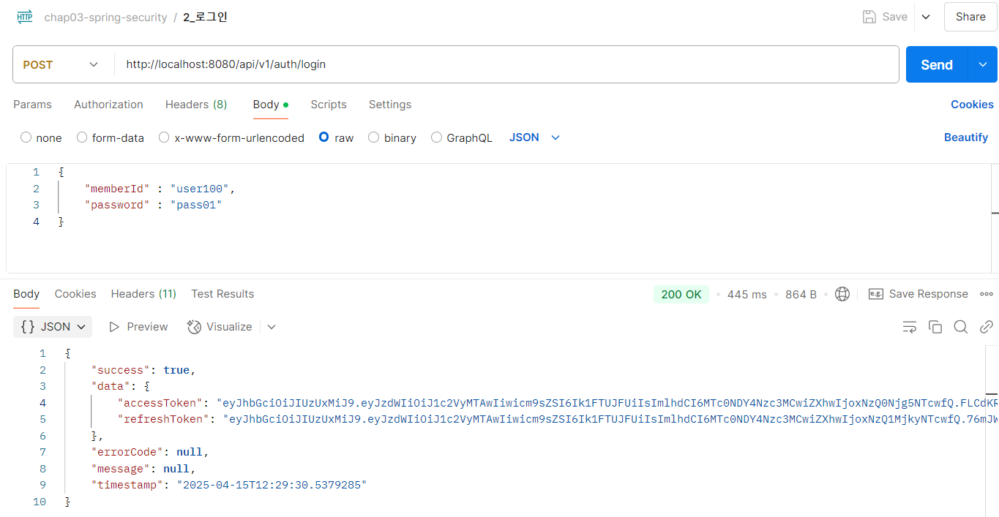

# "책으로 Book적, 이야기로 Book적"

 

## 📚 목차  
- [👥 팀원 소개](#-팀원-소개) 
- [📌 프로젝트 소개](#-프로젝트-소개)  
  - [1. 프로젝트 개요](#1-프로젝트-개요)  
  - [2. 주요 기능](#2-주요-기능)  
  - [3. 타 서비스와의 차별점](#3-타-서비스와의-차별점)  
- [📄 요구사항 명세서](#-요구사항-명세서)  
- [🧱 DDD 설계 문서](#-ddd-설계-문서)  
  - [Policy 정의](#policy-정의)  
  - [Context Mapping](#context-mapping)  
- [🧠 DB 설계](#-db-설계)  
  - [🧱 논리 ERD](#-논리-erd)  
  - [🗃️ 물리 ERD](#-물리-erd)  
- [🔗 REST API](#-rest-api)  
- [🏗️ MSA 아키텍처 구조도](#-msa-아키텍처-구조도)  
- [🧪 테스트 결과 보고서](#-테스트-결과-보고서)  
- [📜 Commit 규칙](#-commit-규칙)  
- [💬 팀원 회고](#-팀원-회고)  

 

## 👥 **팀원 소개**

---
|  |  |  |  |  |
|:---:|:---:|:---:|:---:|:---:|
| **김소원** [github.com/wishbornDev](https://github.com/wishbornDev) | **박장우** [github.com/Jangwoo0710](https://github.com/Jangwoo0710) | **부재녕** [github.com/Jayboo816](https://github.com/Jayboo816) | **장현영** [github.com/memory-h](https://github.com/memory-h) | **정유진** [github.com/devyujinjeong](https://github.com/devyujinjeong) |

## 📌 **프로젝트 소개**

---
### 1. 프로젝트 개요

#### 1.1 서비스 개발 동기
[책으로 Book적, 이야기로 Book적]

> ***‘텍스트 힙’ 이란 글자(text)와 멋지다(hip)를 결합한 말***로, 독서가 멋진 유행으로 자리 잡고 있음을 뜻하는 신조어입니다. 최근 MZ 세대를 중심으로 이러한 문화가 유행하며 독서를 취미로 즐기는 사람들이 늘어나고 있습니다.

종이책의 감성을 선호하거나, 인스타그램·블로그 등을 통해 **자신의 독서 기록을 공유**하는 문화도 함께 확산되고 있습니다.

하지만 **도서를 구매하는 플랫폼과 독서 내용을 나누는 공간이 분리**되어 있어, 독서 활동이 자연스럽게 이어지기 어려운 점이 있습니다.

이에 따라, <u><b>도서 구매부터 독서 공유까지 한 번에 이어지는 플랫폼</b></u>
을 만들고자 **Book적Book적** 서비스를 기획하게 되었습니다.

  

#### 1.2 서비스 설명

> **Book적Book적**은 책을 중심으로 한 웹 기반 도서 서비스입니다.

사용자는 다양한 도서를 검색하고 상세 정보를 확인하거나 구매할 수 있으며, **커뮤니티 기능을 통해 책에 대한 생각과 경험을 자유롭게 공유**할 수 있습니다.

또한, 팔로우 기능을 통해 다른 사용자의  커뮤니티 활동을 확인하며, 책을 매개로 소통하며 **자연스럽게 독서 습관을 형성**해 나갈 수 있습니다.

#### 1.3 서비스 목표

✅ 사용자의 **독서 경험을 풍부하게** 하고, **자연스러운 독서 습관 형성**을 지원합니다.

✅ 책을 좋아하는 사람들이 **서로 소통하고 의견을 나눌 수 있는 커뮤니티 공간**을 마련합니다.

✅ **팔로우 기능을 통한 네트워크 형성**으로, 개인의 독서 활동이 더 확장될 수 있도록 유도합니다.

### 2. 주요 기능

---

#### 2.1 회원 관리

- **회원가입 및 로그인**
    - 회원가입과 로그인을 할 수 있습니다.
    - 비밀번호 찾기 기능을 제공합니다.
- **회원 정보 수정**
    - 마이페이지에서 회원 정보와 활동 내역을 확인하고 수정할 수 있습니다.
    - 사용자는 관심 도서와 관심 작가를 등록하거나 삭제할 수 있습니다.

#### 2.2 도서 정보 조회 및 구매

- **도서 검색 및 조회**
    - 도서 API를 연동하여 도서 목록을 확인할 수 있습니다.
    - 도서명, 저자명, 출판사명 등의 키워드를 기반으로 검색할 수 있습니다.
    - 도서 상세 페이지에서 책 소개, 저자 및 출판사 정보, 구매자 리뷰를 확인할 수 있습니다.
- **장바구니 및 결제**
    - 도서를 장바구니에 담아 한 번에 결제할 수 있습니다.
    - 토스페이 연동을 통해 간편하게 결제할 수 있습니다.
    - 결제 내역과 배송 현황은 마이페이지에서 확인할 수 있습니다.

#### 2.3 소셜 기능

- **팔로우/팔로워 기능**
    - 관심 있는 사용자의 독서 활동을 팔로우할 수 있습니다.
    - 팔로우한 사용자의 게시글을 피드를 통해 확인할 수 있습니다.
    - 마이페이지에서 팔로우 목록과 활동 내역을 관리할 수 있습니다.
- **독서 커뮤니티**
    - 누구나 게시글을 올릴 수 있는 자유 게시판 형태의 커뮤니티를 운영합니다.
    - 독서 감상, 추천 도서, 책에 대한 질문 등을 자유롭게 공유할 수 있습니다.
    - 댓글을 통해 사용자 간 소통이 가능합니다.
    - 커뮤니티 활동 내역은 마이페이지에서 확인할 수 있습니다.

### 3. 타 서비스와의 차별점

---

#### 3-1. 도서 구매와 커뮤니티의 통합

- 기존 플랫폼은 도서 구매(예: 예스24)와 커뮤니티(예: 독서 블로그, SNS)가 분리되어 있습니다.
- Book적Book적은 한 플랫폼 내에서 도서 구매부터 감상 공유까지 연속된 흐름을 제공합니다.
- 독서를 시작하고 끝내는 모든 과정이 하나의 공간에서 이루어집니다.

#### 3-2. 팔로우 기반 독서 네트워크

- 팔로우 기능을 통해 관심 있는 사용자의 활동을 지속적으로 확인할 수 있습니다.
- 다른 사람의 독서 감상과 리뷰를 접하며 책을 매개로 한 네트워크를 형성할 수 있습니다.
- 독서는 더 이상 혼자만의 취미가 아닌, 서로 자극을 주는 경험으로 확장됩니다.

#### 3-3. 단순하고 실용적인 커뮤니티 운영

- 간결한 구조를 통해 사용자 접근성이 높고, 운영이 효율적입니다.
- 복잡한 기능보다는 실제 독서 경험 공유에 집중된 서비스를 제공합니다.

 

## 📄 **요구사항 명세서**

---

## 🧱 **DDD 설계 문서**

---
>DDD 설계 문서 링크 : https://miro.com/app/board/uXjVIP3NJ88=/

### Policy 정의

  
  

  

  

  

  

  

 

### Context Mapping

 

## 🧠 **DB 설계**

---
### 🧱 **논리 ERD**

### 🗃️ **물리 ERD**

 

## 🔗 **REST API**

---

 

## 🏗️ **MSA 아키텍처 구조도**

---

 

## 🧪 **테스트 결과 보고서**

---

  
회원

  

    
회원가입

    
  

  

    
로그인

    
  

  

    
로그아웃

    
  

  

    
토큰 재발급

    
  

  

    
회원 상세 정보

    
  

  

    
팔로우

    

      
팔로우 목록 조회하기

      
    

    

      
팔로우 추가하기

      
      
    

    

      
팔로우 삭제하기

      
      
    

    

      
게시글 목록 가져오기

      
    

  

  
도서

  

    
도서 리뷰

    

      
도서 리뷰 등록

      
    

    

      
도서 리뷰 수정

      
    

    

      
도서 리뷰 삭제

      
    

    

      
도서 KEYWORD 조회

      
    

    

      
도서 상세 조회

      
    

    

      
주간 인기 도서 조회

      
    

  

  

    
도서 API

    
  

  
관심

  

    
관심 도서

    

      
조회

      
    

    

      
추가

      
      
    

    

      
삭제

      
      
    

  

  

    
관심 작가

    

      
조회

      
    

    

      
추가

      
      
    

    

      
삭제

      
      
    

  

  
커뮤니티

  

    
게시글 목록 조회

    
  

  

    
게시글 상세 조회

    
  

  

    
게시글 추가

    
  

  

    
게시글 수정

    
  

  

    
게시글 삭제

    
  

  
CS

  

    
문의 사항

    

      
문의사항 삭제

      
    

    

      
카테고리 가져오기

      
    

    

      
특정 회원의 문의 사항 목록

      
    

    

      
특정 회원의 특정 문의 사항

      
    

    

      
문의사항 등록

      
    

    

      
문의사항 수정

      
    

  

  
구매

  

    
장바구니

    

      
장바구니 목록 조회

      
    

    

      
장바구니 등록

      
    

    

      
장바구니 도서 수량 변경

      
    

    

      
장바구니 도서 삭제

      
    

  
  
  

    
임시 주문 정보 생성

    
  

  

    
결제 승인

    
  

  
관리자

  

  
도서 관리

  

    
도서 정보 삭제

    
  

  

    
도서 카테고리 삭제

    
  

  

    
도서 추가

    
  

  

    
도서 카테고리 추가

    
  

  

    
도서 수량 수정

    
  

  

    
도서 정보 수정

    
  

  

    
도서 카테고리 수정

    
  

  

    
멤버 조회

    

      
닉네임/아이디로 특정 멤버 조회

      
      
    

    

      
전체 멤버 조회

      
      
    

  

## 📜 **Commit 규칙**

---
- ✨ **`feat`**: 새로운 기능 추가, 기존 기능을 요구 사항에 맞추어 수정
- 🐛 **`fix`**: 기능에 대한 버그 수정
- 🚀 **`chore`**: 패키지 매니저 수정, 기타 설정 파일 수정 (예: `.gitignore`)
- 📝 **`docs`**: 문서 및 주석 수정 (예: README)
- 🛠️ **`refactor`**: 기능 변화 없이 코드 리팩토링 (예: 변수 이름 변경, 메서드 추출)
- 🎨 **`style`**: 코드 스타일, 포매팅 관련 수정
- ✏️ **`test`**: 테스트 코드 추가 또는 수정

 

## 💬 **팀원 회고**

---
| **팀원**  | **프로젝트 회고**                                                                                                                                                                                                                                                                                                 |
|---------|-------------------------------------------------------------------------------------------------------------------------------------------------------------------------------------------------------------------------------------------------------------------------------------------------------------|
| **김소원** |            도서 정보를 전달 받을 수 있는 API의 종류는 많지만 원하는 데이터를 모두 전달받을 수 있는 오픈 API를 찾기는 쉽지 않았습니다. 이번 프로젝트로 API를 찾아보고 또 연동하면서 앞으로 개발을 하면서 유용하게 사용할 수 있는 API를 직접 만들어보고 싶어졌습니다.                                                                                                                                                                                                                                                                                                  |
| **박장우** |   백엔드 내용이 정말 쉽지 않았던지라 많은 어려움이 있었지만 팀원 분들이 많이 도와주시고 끌어주신 덕분에 프로젝트를 무사히 마칠 수 있었습니다. 이번 프로젝트를 통해서 자바와 스프링이 실무에 어떤 방식으로 사용되는지 눈으로 직접 확인할 수 있었고, 백엔드의 중요성 또한 깨달을 수 있었습니다. 아직 프런트엔드 프로젝트가 남은 만큼 팀원들과의 화합을 유지하면서 맡은 임무에 충실할 수 있도록 최선을 다하겠습니다. 모두 정말 수고 많으셨고 감사합니다.                                                                                                                                                                                                                                                                                                          |
| **부재녕** | 자바 프로젝트를 처음 접하면서, 각 어노테이션들이 어디서 어떻게 사용되는지, 각 기능들이 어떻게 작동되는지 플로우를 이해하는데 어려움을 겪었다. 하지만 강사님의 강의를 다시 들으면서 천천히 코드를 작성해가며 이해도를 높이기 위해 노력했다. 복습의 중요성을 다시 한 번 더 느끼게 됐습니다. 그리고 팀원분들께서도 제가 질문할때마다 항상 도와주시고 이해하기 쉽게 설명해주셔서 감사함을 느꼈습니다. 적극적인 의사소통이 팀워크에서 참 중요하다는것을 느낄 수 있었습니다. 팀원들과 함께 노력하면서 같이 성장할 수 있어서 뜻깊은 프로젝트였습니다! |
| **장현영** |         토스페이먼츠 API를 활용해 주문 및 결제 기능을 직접 구현하면서 실제 결제 시스템의 흐름을 이해하고 적용할 수 있어 매우 유익한 경험이었습니다.                                                                                                                                                                                                                                                                                                    |
| **정유진** |         Spring으로 개발할 때 어떤 흐름으로 개발하는지 확실히 배우는 기회가 됐다. 그리고, 백엔드 수업을 들으면서 모호했다고 느꼈던 부분이 해소됐다.                                                                                                                                                                                                                                                                                                    |
